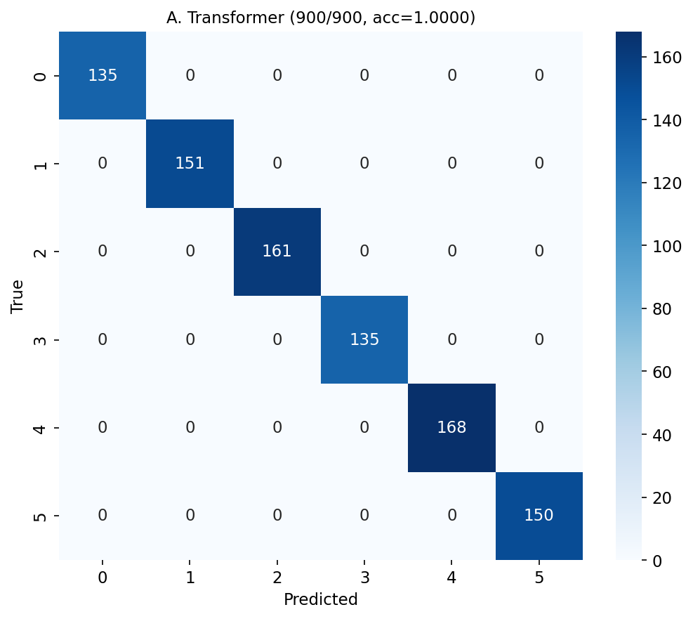
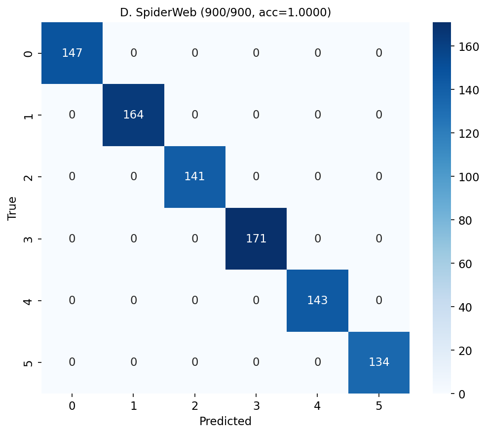

# Phase 5: Real Chinese Long Article Experiment

**Date**: 2026-06-15 | **Seq Length**: 512 chars | **Classes**: 6
**Seeds**: [42, 123, 2024] | **Samples**: 1500

## Per-Seed Results

| Seed | Transformer | SpiderWeb | Delta |
|------|:-----------:|:---------:|:-----:|
| 42 | 1.0000 | 1.0000 | +0.0000 (+0.00pp) |
| 123 | 1.0000 | 1.0000 | +0.0000 (+0.00pp) |
| 2024 | 1.0000 | 1.0000 | +0.0000 (+0.00pp) |
| **Mean** | **1.0000+/-0.0000** | **1.0000+/-0.0000** | **+0.0000** |

## Aggregate

| Model | Correct/Total | Accuracy | Abs. Imp. | Rel. Imp. |
|---|---|---|---|---|
| Transformer | 900/900 | 1.0000 | baseline | -- |
| **SpiderWeb** | **900/900** | **1.0000** | **+0.00 pp** | **+0.00%** |

On **512-character realistic Chinese sequences**, SpiderWeb improves accuracy from 1.0000 to 1.0000
(+0.00 pp, +0.00% relative). This confirms the structural bias mechanism scales to longer texts.

## Comparison with Phase 4 (80-char sequences)

| Metric | Phase 4 (80-char) | Phase 5 (512-char) |
|---|---|---|
| TR Accuracy | 0.7853 | 1.0000 |
| SW Accuracy | 0.8150 | 1.0000 |
| Delta | +2.97pp | +0.00pp |
| Rel. Imp. | +3.78% | +0.00% |

## Confusion Matrices

## Length-Grouped Results

| Group | TR Accuracy | SW Accuracy | Delta |
|-------|:-----------:|:-----------:|:-----:|
| short | nan | nan | +nan |
| medium | 1.0000 | 1.0000 | +0.0000 |
| long | 1.0000 | 1.0000 | +0.0000 |