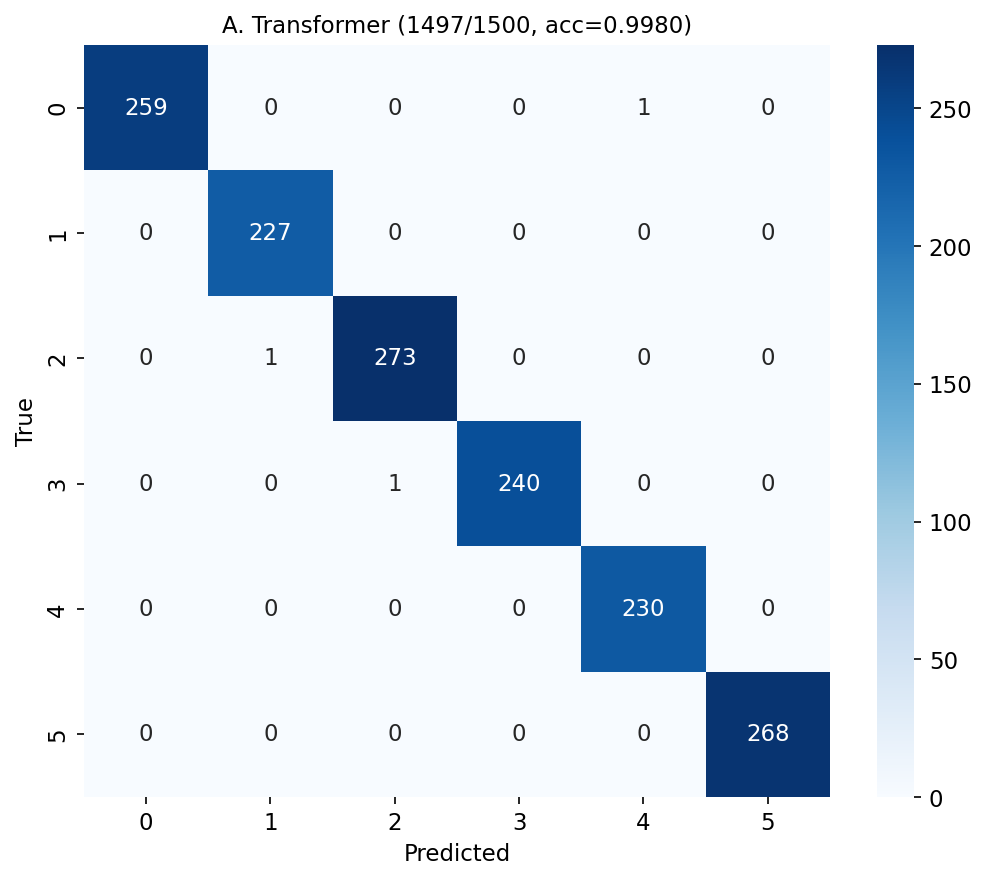
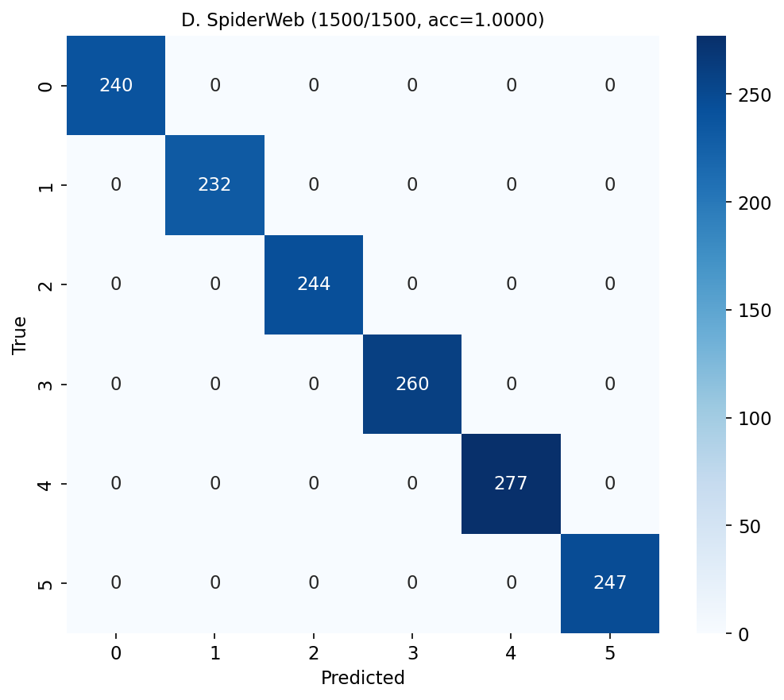

# Phase 5 V2: Hard Real Chinese Long Article Experiment

center_bonus=0.1, support_bonus=0.04, topic_size=5
Seeds: [42, 123, 2024, 3407, 9999], Samples: 1500, Max Length: 512

## Per-Seed

| Seed | Transformer | SpiderWeb | Delta |
|------|:-----------:|:---------:|:-----:|
| 42 | 1.0000 | 1.0000 | +0.0000 (+0.00pp) |
| 123 | 0.9933 | 1.0000 | +0.0067 (+0.67pp) |
| 2024 | 1.0000 | 1.0000 | +0.0000 (+0.00pp) |
| 3407 | 0.9967 | 1.0000 | +0.0033 (+0.33pp) |
| 9999 | 1.0000 | 1.0000 | +0.0000 (+0.00pp) |
| **Mean** | **0.9980+/-0.0027** | **1.0000+/-0.0000** | **+0.0020** |

## Aggregate

| Model | Correct/Total | Accuracy | Abs. Imp. | Rel. Imp. |
|---|---|---|---|---|
| Transformer | 1497/1500 | 0.9980 | baseline | -- |
| **SpiderWeb** | **1500/1500** | **1.0000** | **+0.20 pp** | **+0.20%** |

