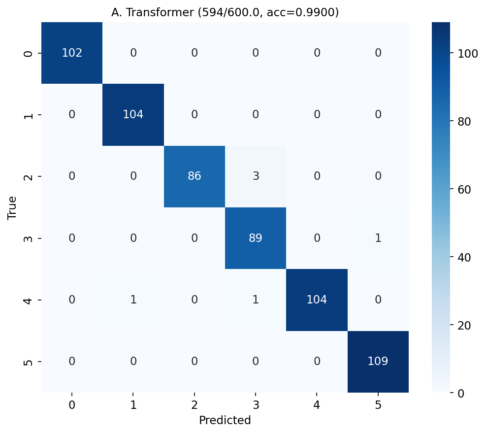
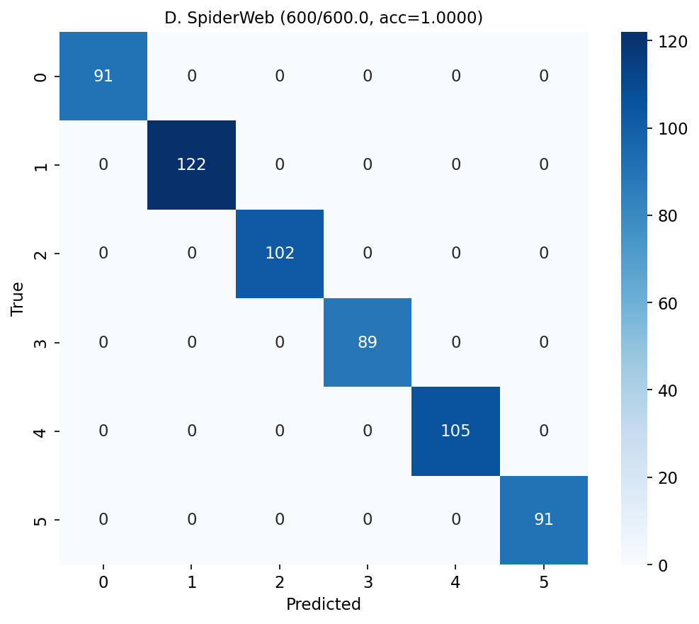

# Phase 5 V3: Real Chinese Long Article Experiment

center_bonus=0.1, support_bonus=0.04, max_len=512
Seeds: [42, 123, 2024], Samples: 1000, Epochs: 6

## Per-Seed

| Seed | Transformer | SpiderWeb | Delta |
|------|:-----------:|:---------:|:-----:|
| 42 | 1.0000 | 1.0000 | +0.0000 (+0.00pp) |
| 123 | 0.9700 | 1.0000 | +0.0300 (+3.00pp) |
| 2024 | 1.0000 | 1.0000 | +0.0000 (+0.00pp) |
| **Mean** | **0.9900+/-0.0141** | **1.0000+/-0.0000** | **+0.0100** |

| Model | Correct/Total | Accuracy | Abs. Imp. | Rel. Imp. |
|---|---|---|---|---|
| Transformer | 594.0/600.0 | 0.9900 | baseline | -- |
| **SpiderWeb** | **600.0/600.0** | **1.0000** | **+1.00 pp** | **+1.01%** |

## Comparison: Phase 4 vs Phase 5

| Metric | Phase 4 (80-char synth) | Phase 5 (512-char real) |
|--------|------------------------|------------------------|
| TR | 0.7853 | 0.9900 |
| SW | 0.8150 | 1.0000 |
| Delta | +2.97pp | +1.00pp |

