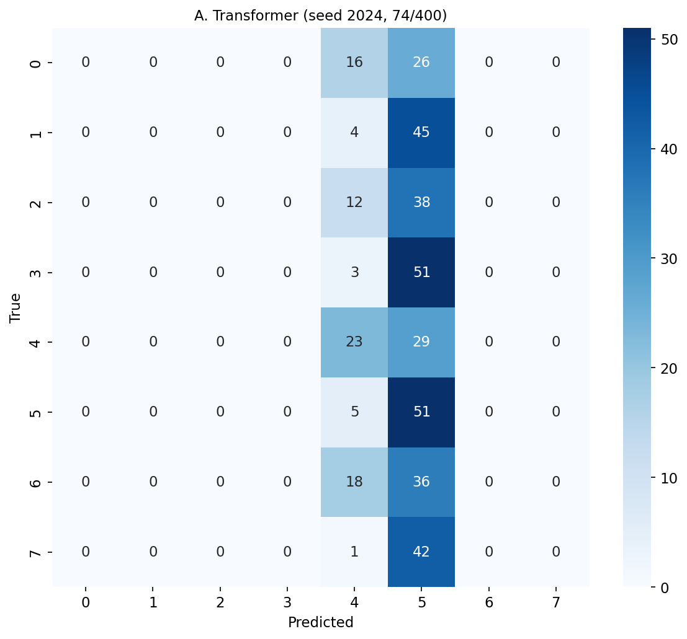
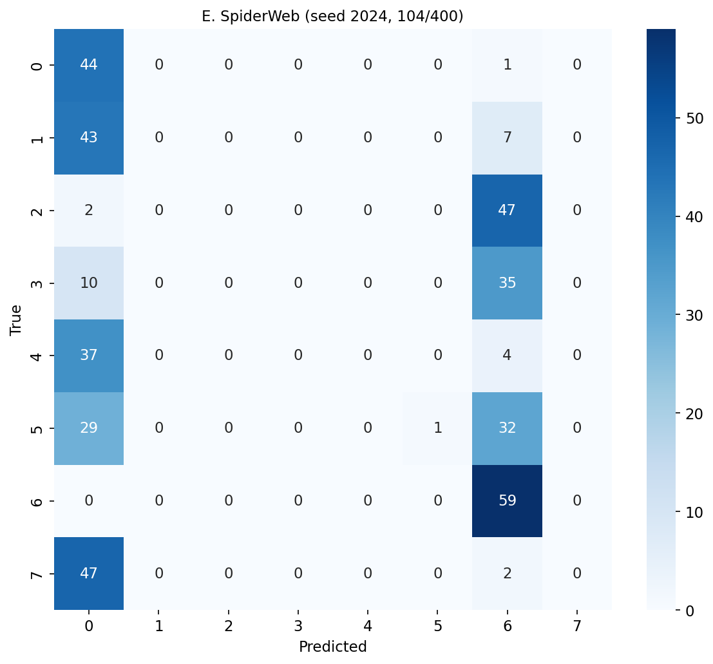

# Phase 6: Hard Dataset Experiment Report

**Setup**: max_len=256, batch=8, seeds=[42, 123, 2024], epochs=3
**Data**: center_bonus=0.05, shared tokens, distractors, 8 classes

**TF-IDF baseline**: 0.1250 (STRUCTURE-DEPENDENT PASS)

## Results

| Model | Accuracy | Macro-F1 | Delta vs TR |
|---|---|---|---|
| A: Transformer | 0.3933+/-0.2277 | 0.3302+/-0.2368 | +0.00pp |
| B: +Position | 0.1583+/-0.0586 | 0.0522+/-0.0368 | -23.50pp |
| C: +RandomBias | 0.2425+/-0.1785 | 0.1734+/-0.1759 | -15.08pp |
| D: +SimpleStruct | 0.5300+/-0.1285 | 0.4486+/-0.1637 | +13.67pp |
| E: +SpiderWeb | 0.6308+/-0.2963 | 0.5886+/-0.3522 | +23.75pp |

**SpiderWeb vs Transformer: +23.75pp**

